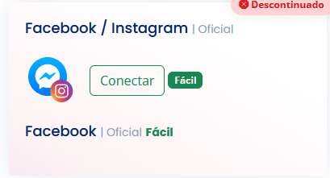

# Configuração hub - instagram - facebook

- Acessar
https://hub.notificame.com.br/

- Acesso somente instagram usar - "Instagram V2 | Oficial"

>

- Acesso somente Facebook usar - "Facebook| Oficial"

>

- Usar mesmo canal para os dois - "Facebook / Instagram | Oficial"

>

- Sistema também suporta WebChat

>

- Apos conectar canal no Hub deve pegar token para colocar no Whazing

>

- No whazing - Configurações - Canais - Token Hub - Cadastrar token copiado do Hub

>

- Agora so colocar adicionar Canal e escolher Hub

# Não é possivel iniciar conversa com HUB somente responder depois da interação do cliente

# Valores painel revenda hub

1 a 39 canais por canal R$ 40,00

40 a 99 canais por canal R$ 35,00

### Instagram/Facebook 
conta como 1 canal 
as contas precisam está vinculadas
